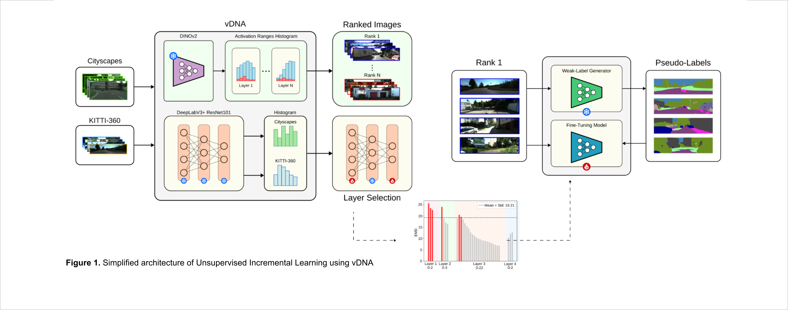
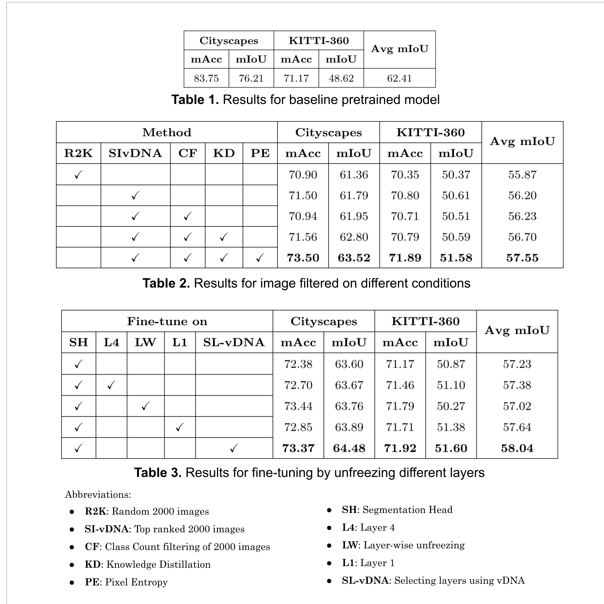
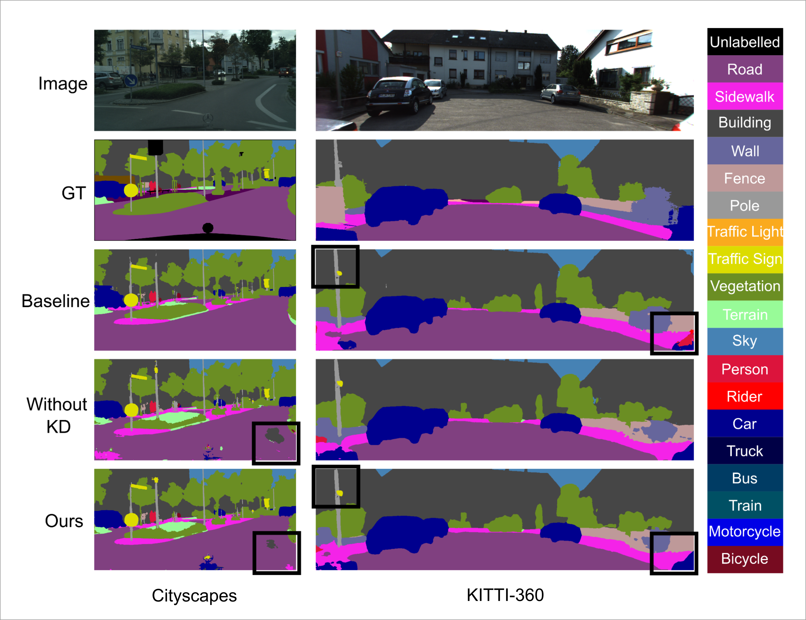

# Unsupervised Incremental Learning using vDNA

## Overview
This repository implements a framework for unsupervised incremental learning using visual DNA (vDNA). The main goal is to adapt the DeepLabV3Plus_resnet101 architecture, initially trained on the Cityscapes dataset, to the KITTI-360 dataset. The project leverages self-training using weak label generation and knowledge distillation to incrementally fine-tune the model on new datasets.

## Table of Contents
1. [Features](#features)
2. [Installation](#installation)
3. [Datasets](#datasets)
4. [Pretrained Checkpoints](#pretrained-checkpoints)
5. [Usage](#usage)
6. [Architecture and Results](#architecture-and-results)
7. [Reference](#reference)

## Features
**Source Dataset and Model**: Cityscapes trained on DeepLabV3Plus-ResNet101 Architecture.

**Target Dataset**: KITTI-360

- **Dataset Conditioning**: Apply Visual DNA (vDNA) to identify source-target dataset relationships, using Earth Mover's Distance (EMD) to quantify distributional similarity
- **Layer Selection**: Apply vDNA to determine optimal layers to fine-tune.
- **Self-training**: Use pre trained DeepLabV3Plus model to generate pseudo labels and then fine-tune the same model using generated labels.
- **Knowledge Retention**: Employ Knowledge Distillation (KD) on the output logits.
- **Pipeline Automation**: Automated training and testing pipeline for seamless execution.


## Installation

### Clone the repository
```sh
git clone https://github.com/DLL-Project-Incremental-Learning/Unsupervised-Incremental-Learning-vDNA.git
```

### Install the required dependencies
```sh
pip install -r requirements.txt
```

## Datasets

### Download Cityscapes and extract it to `datasets/data/cityscapes`
```
/datasets
    /data
        /cityscapes
            /gtFine
            /leftImg8bit
```

### Download KITTI-360 and extract it to `datasets/data/KITTI-360`
```
/datasets
    /data
        /KITTI-360
            /data_2d_raw
            /data_2d_semantics
```

## Pretrained Checkpoints

### Download pretrained and fine-tuned checkpoints to the `/checkpoints` folder
- Pretrained checkpoint: [Download Link](https://drive.google.com/file/d/1t7TC8mxQaFECt4jutdq_NMnWxdm6B-Nb/view)
- Fine-tuned checkpoint: [Download Link](https://drive.google.com/file/d/1TmisTL5cdxxdYTmh5719kXkQsocTXlSN/view?usp=drive_link)

## Usage

### Training and Testing
Run the `run_train_test.py` script to execute the training and testing pipeline, process the results, and log the mIoU metrics for both the Cityscapes and KITTI datasets.
```sh
python run_train_test.py
```

### Pipeline Execution
The main training and fine-tuning pipeline is implemented in `pipeline_ordered_buckets.py`. This script processes data in ordered buckets, generates weak labels, and fine-tunes the model iteratively.
```sh
python src/pipeline_ordered_buckets.py ./configs/training_pipeline.json
```

### Weak Label Generation
The `weaklabelgenerator.py` script generates weak labels for a set of images using a pre-trained model.

### Fine-Tuning Buckets
The `finetune_bucket.py` script fine-tunes the model on each data bucket using knowledge distillation.

### Visual DNA (vDNA)
Refer to the repository for implementation and usage : [Github vDNA](https://github.com/bramtoula/vdna)

### Configuration
The configuration files for training, testing, and weak label generation are located in the `configs` directory. These JSON files specify various parameters and options for the pipeline.

Example configuration file for training pipeline (`configs/training_pipeline.json`):
```json
{
  "random_seed": 42,
  "data_processor": {
    "json_file": "path/to/data_processor_config.json",
    "num_buckets": 5,
    "train_ratio": 0.8
  },
  "buckets_order": "asc",
  "model": "DeepLabV3Plus",
  "ckpt": "path/to/checkpoint.pth",
  "teacher_ckpt": "path/to/teacher_checkpoint.pth",
  "num_classes": 19,
  "output_stride": 16,
  "labelgenerator": {
    "num_samples": 100
  }
}
```

### New Datasets
You can train DeepLab models on your own datasets. Your `torch.utils.data.Dataset` should provide a decoding method that transforms your predictions to colorized images.
```python
class MyDataset(data.Dataset):
    ...
    @classmethod
    def decode_target(cls, mask):
        """decode semantic mask to RGB image"""
        return cls.cmap[mask]
```

## Architecture and Results
### Block Digram


### Quantitative Results:


### Qualitative Results


## Reference
1. X. Liu et al., "Deep Unsupervised Domain Adaptation: A Review of Recent Advances and Perspectives," arXiv:2208.07422 [cs.CV], Aug. 2022.
2. B. Ramtoula, J. Valentin, and P. H. S. Torr, "Visual DNA: Representing and Comparing Images using Distributions of Neuron Activations," arXiv:2304.10036 [cs.CV], Apr. 2023.
