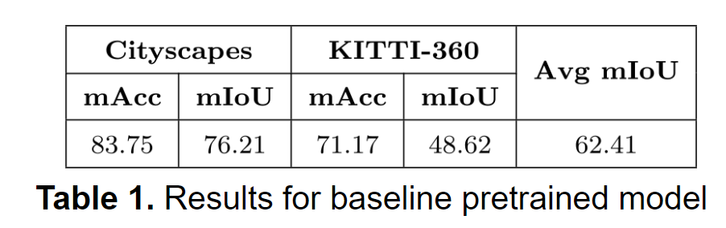
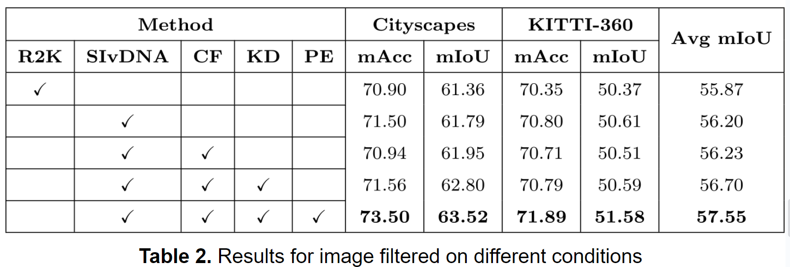
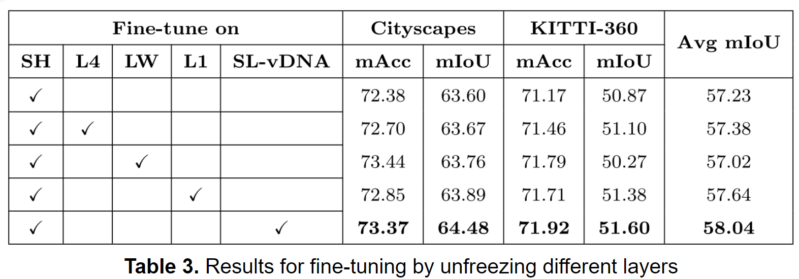
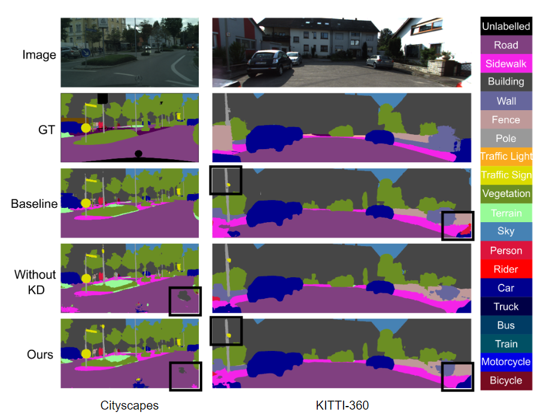

# Unsupervised Incremental Learning using vDNA

## Overview
This repository implements a framework for unsupervised incremental learning using virtual DNA (vDNA). The main goal is to adapt the DeepLabV3Plus_resnet101 architecture, which is initially trained on the Cityscapes dataset, to the KITTI-360 dataset. The project leverages weak label generation and knowledge distillation to iteratively fine-tune the model on new data buckets.

## Features
Incremental Learning: Adaptation of a pre-trained model to a new dataset using incremental learning techniques.
Weak Label Generation: Automatic generation of weak labels for new data.
Knowledge Distillation: Fine-tuning the model using knowledge distillation from a teacher model.
Pipeline Automation: Automated training and testing pipeline for seamless execution.


## Installation

### Clone the repository:
git clone [https://github.com/yourusername/unsupervised-incremental-learning-vdna.git](https://github.com/DLL-Project-Incremental-Learning/DeeplabV3_Cityscapes)

Install the required dependencies:

```pip install -r requirements.txt```

## Datasets

### 1. Download cityscapes and extract it to 'datasets/data/cityscapes'

```
/datasets
    /data
        /cityscapes
            /gtFine
            /leftImg8bit
```

### 2. Download KITTI-360 and extract it to 'datasets/data/KITTI-360'

```
/datasets
    /data
        /KITTI-360
            /data_2d_raw
            /data_2d_semantics
```

## Pretrained Checkpoints

### Download pretrained and finetuned checkpoints to the folder 
```/checkpoints ```

Pretrained checkpoint: ```https://drive.google.com/file/d/1t7TC8mxQaFECt4jutdq_NMnWxdm6B-Nb/view```


Fine-tuned checkpoint: ```https://drive.google.com/file/d/1TmisTL5cdxxdYTmh5719kXkQsocTXlSN/view?usp=drive_link```

## Usage

### Training and Testing
The run_train_test.py script executes the training and testing pipeline, processes the results, and logs the mIoU metrics for both the Cityscapes and KITTI datasets.

```python run_train_test.py```

### Pipeline Execution
The main training and fine-tuning pipeline is implemented in pipeline_ordered_buckets.py. This script processes data in ordered buckets, generates weak labels, and fine-tunes the model iteratively.

```python src/pipeline_ordered_buckets.py ./configs/training_pipeline.json```


### Weak Label Generation
The weaklabelgenerator.py script generates weak labels for a set of images using a pre-trained model.

### Fine-Tuning Buckets
The finetune_bucket.py script fine-tunes the model on each data bucket using knowledge distillation.

### Configuration
The configuration files for training, testing, and weak label generation are located in the configs directory. These JSON files specify various parameters and options for the pipeline.

Example configuration file for training pipeline (configs/training_pipeline.json):
```
{
  "random_seed": 42,
  "data_processor": {
    "json_file": "path/to/data_processor_config.json",
    "num_buckets": 5,
    "train_ratio": 0.8
  },
  "buckets_order": "asc",
  "model": "DeepLabV3Plus",
  "ckpt": "path/to/checkpoint.pth",
  "teacher_ckpt": "path/to/teacher_checkpoint.pth",
  "num_classes": 19,
  "output_stride": 16,
  "labelgenerator": {
    "num_samples": 100
  }
}
```


### New datasets

You can train deeplab models on your own datasets. Your ``torch.utils.data.Dataset`` should provide a decoding method that transforms your predictions to colorized images.
```python

class MyDataset(data.Dataset):
    ...
    @classmethod
    def decode_target(cls, mask):
        """decode semantic mask to RGB image"""
        return cls.cmap[mask]
```


## Results






## Reference

[1] X. Liu et al., "Deep Unsupervised Domain Adaptation: A Review of Recent Advances and Perspectives," arXiv:2208.07422 [cs.CV], Aug. 2022.

[2] B. Ramtoula, J. Valentin, and P. H. S. Torr, "Visual DNA: Representing and Comparing Images using Distributions of Neuron Activations," arXiv:2304.10036 [cs.CV], Apr. 2023.
